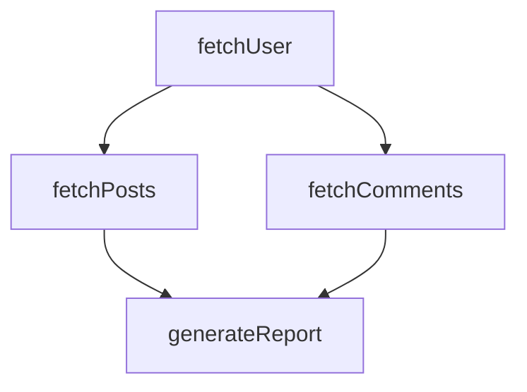

# @ramplex/workflow

A TypeScript library for building and executing workflows with interdependent tasks. Execute tasks in parallel when possible while respecting dependencies, with built-in retry policies and error handling.

# Table of Contents

- [Features](#features)
- [Installation](#installation)
- [Quick Start](#quick-start)
- [Advanced Usage](#advanced-usage)
  - [Understanding Dependency Execution](#understanding-dependency-execution)
    - [Context object](#context-object)
    - [Node execution](#node-execution)
  - [Disabling Nodes](#disabling-nodes)
  - [Visualizing Workflow Dependencies](#visualizing-workflow-dependencies)
  - [Setting Context and Dependencies](#setting-context-and-dependencies)
  - [Error Handling](#error-handling)
  - [Retry Policy](#retry-policy)
- [API Reference](#api-reference)
- [Contributing](#contributing)
- [License](#license)

# Features

- **Dependency-Based Execution**: Define interdependent tasks that execute in the correct order based on their dependencies
- **Parallel Execution**: Independent nodes run concurrently for optimal performance
- **Type-Safe Context**: Full TypeScript support with strongly typed context passing between nodes
- **Retry Policies**: Built-in retry mechanism with configurable attempts and delays
- **Error Resilience**: Failed nodes don't block independent branches from executing
- **Flexible Node Types**: Support for both synchronous and asynchronous execution functions
- **Node Enable/Disable**: Conditionally execute nodes with static or dynamic conditions
- **Error Handling**: Node-specific and workflow-level error handlers
- **Circular Dependency Detection**: Prevents invalid workflow configurations at build time
- **Context Management**: Immutable context objects with sequential updates for consistency

# Installation

Install @ramplex/workflow using npm, pnpm, or yarn:

```bash
npm install @ramplex/workflow
yarn add @ramplex/workflow
pnpm install @ramplex/workflow
```

# Quick Start

Here's a simple example to get you started with @ramplex/workflow:

```typescript
import { Workflow } from '@ramplex/workflow';

// Define your workflow
const workflow = new Workflow({
  // Optional: provide initial context value
  contextValue: { userId: 123, apiKey: "secret" },
})
  .addNode({
    id: "fetchUser",
    execute: async (ctx) => {
      // Access initial context at ctx.initial
      const response = await fetch(`/api/users/${ctx.initial.userId}`);
      return response.json();
    },
  })
  .addNode({
    id: "fetchPosts",
    execute: async (ctx) => {
      // Access fetchUser's result directly from context
      const posts = await fetch(`/api/users/${ctx.fetchUser.id}/posts`);
      return posts.json();
    },
    // Will only execute after fetchUser completes
    dependencies: ["fetchUser"],
  })
  .addNode({
    id: "fetchComments",
    execute: async (ctx) => {
      // This runs in parallel with fetchPosts since both depend only on fetchUser
      const comments = await fetch(`/api/users/${ctx.fetchUser.id}/comments`);
      return comments.json();
    },
    dependencies: ["fetchUser"],
  })
  .build({
    // Optional: handle workflow completion
    onNodesCompleted: (ctx, errors) => {
      if (errors) {
        console.error("Some nodes failed:", errors);
      } else {
        console.log("Workflow completed successfully");
      }
    },
  });

// Execute the workflow
const result = await workflow.trigger();

// Result contains all node outputs:
// {
//   initial: { userId: 123, apiKey: "secret" },
//   fetchUser: { id: 123, name: "John" },
//   fetchPosts: [...],
//   fetchComments: [...]
// }
```

# Advanced Usage

## Understanding Dependency Execution

### Context object

The context object provides type-safe access to node results:

- All nodes receive a context object as their only parameter
- The initial context (if provided) is available at `ctx.initial`
- Node results are available under their node ID (e.g., `ctx.nodeId`)
- The context is immutable - attempting to modify it will result in a runtime error
- Nodes can only access results from their declared dependencies
- The node ID `"initial"` is reserved and cannot be used

### Node execution

The workflow executor optimizes performance through intelligent scheduling:

- **Parallel execution**: Nodes with no dependencies run concurrently
- **Sequential execution**: Dependent nodes wait for their dependencies
- **Branch independence**: Failed nodes don't affect unrelated branches
- **Circular dependencies**: Detected at build time and throw an error

Examples:
- 3 nodes with no dependencies → all run in parallel
- Node B depends on A, C depends on B → sequential execution A→B→C
- Nodes B and C both depend on A → A runs first, then B and C in parallel

## Disabling Nodes

You can control node execution using the `enabled` option. This can be either a static boolean value or a dynamic function that evaluates at runtime based on the context.

### Static Disabling

When a node is disabled with `enabled: false`, it and all nodes that depend on it will not execute:

```typescript
const workflow = new Workflow()
  .addNode({
    id: "processData",
    execute: () => "processed",
  })
  .addNode({
    id: "validateData",
    dependencies: ["processData"],
    execute: () => "validated",
  })
  .addNode({
    id: "optionalEnhancement",
    execute: () => "enhanced",
    enabled: false, // This node is disabled
  })
  .addNode({
    id: "finalStep",
    dependencies: ["validateData", "optionalEnhancement"],
    execute: () => "completed",
  })
  .build();

const result = await workflow.trigger();
// Result: {
//   initial: undefined,
//   processData: "processed",
//   validateData: "validated"
// }
// Note: optionalEnhancement and finalStep are not executed
```

### Dynamic Conditional Execution

The `enabled` option can also be a function that receives the context and returns a boolean. This allows nodes to be conditionally executed based on runtime values:

```typescript
const workflow = new Workflow({ contextValue: { threshold: 100 } })
  .addNode({
    id: "fetchMetrics",
    execute: async () => {
      const response = await fetch('/api/metrics');
      return response.json(); // { score: 150 }
    },
  })
  .addNode({
    id: "detailedAnalysis",
    dependencies: ["fetchMetrics"],
    enabled: (ctx) => ctx.fetchMetrics.score > ctx.initial.threshold,
    execute: async (ctx) => {
      // This only runs if score exceeds threshold
      return await analyzeHighScore(ctx.fetchMetrics);
    },
  })
  .addNode({
    id: "sendAlert",
    dependencies: ["detailedAnalysis"],
    execute: async (ctx) => {
      // This only runs if detailedAnalysis ran
      return await notifyTeam(ctx.detailedAnalysis);
    },
  })
  .build();

// If fetchMetrics returns { score: 150 }, detailedAnalysis and sendAlert will run
// If fetchMetrics returns { score: 50 }, neither detailedAnalysis nor sendAlert will run
```

### Conditional Branching

You can use dynamic conditions to implement branching logic:

```typescript
const workflow = new Workflow()
  .addNode({
    id: "checkUserType",
    execute: async (ctx) => {
      const user = await fetchUser(ctx.initial.userId);
      return { isPremium: user.subscription === 'premium' };
    },
  })
  .addNode({
    id: "basicProcessing",
    dependencies: ["checkUserType"],
    enabled: (ctx) => !ctx.checkUserType.isPremium,
    execute: () => "basic features applied",
  })
  .addNode({
    id: "premiumProcessing",
    dependencies: ["checkUserType"],
    enabled: (ctx) => ctx.checkUserType.isPremium,
    execute: () => "premium features applied",
  })
  .addNode({
    id: "finalizeResult",
    dependencies: ["basicProcessing", "premiumProcessing"],
    execute: (ctx) => {
      // Merge results from whichever branch executed
      return {
        basic: ctx.basicProcessing,
        premium: ctx.premiumProcessing,
      };
    },
  })
  .build();
```

## Visualizing Workflow Dependencies

The `printWorkflow` method generates a Mermaid diagram of your workflow structure:

```typescript
const workflow = new Workflow()
  .addNode({ id: "fetchUser", execute: () => "user data" })
  .addNode({ id: "fetchPosts", dependencies: ["fetchUser"], execute: () => "posts" })
  .addNode({ id: "fetchComments", dependencies: ["fetchUser"], execute: () => "comments" })
  .addNode({ id: "generateReport", dependencies: ["fetchPosts", "fetchComments"], execute: () => "report" })
  .build();

console.log(workflow.printWorkflow());
```

Output:
````

````

When rendered, this creates a visual representation of your workflow:


Disabled and conditional nodes are styled differently:

```typescript
const workflow = new Workflow()
  .addNode({ id: "step1", execute: () => "1" })
  .addNode({ id: "step2", execute: () => "2", enabled: false })
  .addNode({ id: "step3", execute: () => "3", enabled: (ctx) => true })
  .addNode({ id: "step4", dependencies: ["step1", "step2", "step3"], execute: () => "4" })
  .build();

console.log(workflow.printWorkflow());
// Output shows:
// - step2 labeled as "(Disabled)" and grayed out
// - step3 labeled as "(Conditional)" with yellow styling
```

This generates a diagram with disabled nodes grayed out and conditional nodes highlighted in yellow, making it easy to see which parts of your workflow are inactive or conditionally executed.

## Setting Context and Dependencies

You can provide initial context either as a static value or through a factory function:

```typescript
// Static context value
const workflow = new Workflow({
  contextValue: { apiKey: "secret", baseUrl: "https://api.example.com" },
})
  .addNode({
    id: "fetchData",
    execute: (ctx) => {
      // Access initial context at ctx.initial
      return fetch(`${ctx.initial.baseUrl}/data`, {
        headers: { Authorization: ctx.initial.apiKey }
      });
    }
  })
  .build();

// Dynamic context factory (sync or async)
const workflow = new Workflow({
  contextFactory: async () => {
    const config = await loadConfiguration();
    const token = await authenticate();
    return { config, token };
  },
})
  .addNode({
    id: "processData",
    execute: (ctx) => {
      // Use dynamically loaded context
      return processWithConfig(ctx.initial.config, ctx.initial.token);
    }
  })
  .build();
```

The workflow provides full TypeScript support, ensuring type safety for context access and node dependencies.


## Error Handling

Handle errors at both the node level and workflow level:

```typescript
const workflow = new Workflow()
  .addNode({
    id: "riskyOperation",
    execute: async (ctx) => {
      // This might fail
      const result = await riskyApiCall();
      return result;
    },
    errorHandler: async (error, ctx) => {
      // Node-specific error handling
      console.error(`Failed to complete risky operation: ${error.message}`);
      await notifyAdmin(error);
      // Note: The error will still propagate after this handler
    }
  })
  .addNode({
    id: "dependentOperation",
    dependencies: ["riskyOperation"],
    execute: (ctx) => {
      // This won't run if riskyOperation fails
      return processResult(ctx.riskyOperation);
    }
  })
  .build({
    onNodesCompleted: (ctx, errors) => {
      if (errors) {
        // Workflow-level error handling
        for (const error of errors) {
          console.error(`Node ${error.id} failed: ${error.message}`);
        }
      } else {
        console.log("Workflow completed successfully");
      }
    }
  });
```

## Retry Policy

Configure automatic retry behavior for nodes that may experience transient failures:

```typescript
const workflow = new Workflow()
  .addNode({
    id: "unreliableService",
    execute: async (ctx) => {
      // Call an API that sometimes fails
      return await callFlakyAPI();
    },
    retryPolicy: {
      maxRetries: 3,        // Retry up to 3 times
      retryDelayMs: 1000    // Wait 1 second between retries
    }
  })
  .build();
```

# API Reference

## Workflow Class

The main class for building workflows.

### Constructor
```typescript
new Workflow(options?: {
  contextValue?: T;
  // OR
  contextFactory?: () => T | Promise<T>;
})
```

### Methods

- `addNode(options)`: Add a node to the workflow
- `build(options?)`: Build the workflow and return a WorkflowRunner

## Node Options

```typescript
interface NodeOptions {
  id: string;                              // Unique node identifier
  execute: (ctx) => T | Promise<T>;        // Node execution function
  dependencies?: string[];                 // Array of dependency node IDs
  enabled?: boolean | ((ctx) => boolean);  // Static or dynamic execution control (default: true)
  retryPolicy?: {                          // Retry configuration
    maxRetries: number;
    retryDelayMs: number;
  };
  errorHandler?: (error, ctx) => void;     // Error handling function
  onCompleted?: (event) => void;           // Node completion handler
}
```

**Note on `enabled`**:
- When `enabled` is a boolean, it statically determines if the node executes
- When `enabled` is a function, it receives the current context (with access to initial context and dependency results) and returns a boolean
- Disabled nodes (static or dynamic) prevent all dependent nodes from executing

## WorkflowRunner

The executor returned by `workflow.build()`.

### Methods

- `trigger()`: Execute the workflow and return the final context
- `printWorkflow()`: Return a Mermaid diagram of the workflow structure

# Contributing

Contributions are welcome! Please describe the contribution in an issue before submitting a pull request. Attach the issue number to the pull request description and include tests for new features / bug fixes.

# License

@ramplex/workflow is [MIT](LICENSE) licensed.
